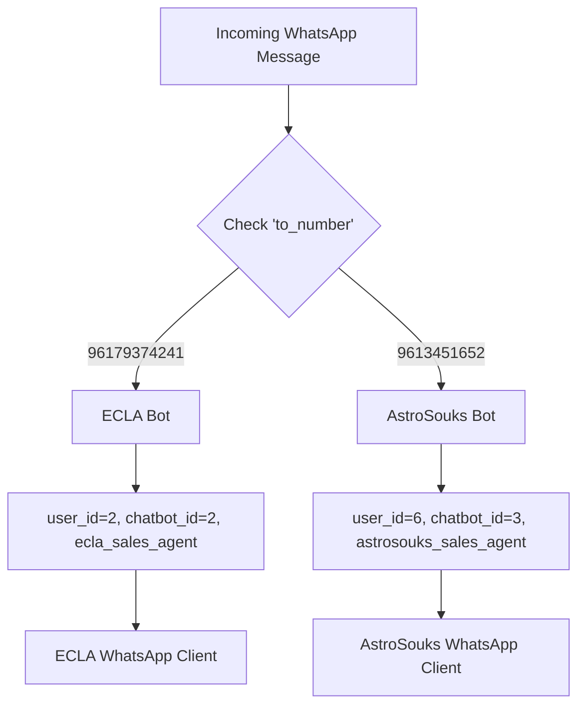

# ✅ Multi-Tenant WhatsApp Configuration Complete

## 🎯 Summary

Successfully configured **two separate WhatsApp chatbots** with complete multi-tenant support:

### 🏢 **Tenant 1: SwiftReplies (ECLA)**
- **WhatsApp Number**: `96179374241` 
- **User ID**: `2` (SwiftReplies admin)
- **Chatbot ID**: `2` (SwiftReplies main bot)
- **Agent**: `ecla_sales_agent`
- **Products**: ECLA teeth whitening products

### 🏢 **Tenant 2: AstroSouks**
- **WhatsApp Number**: `9613451652`
- **User ID**: `6` (AstroSouks user)
- **Chatbot ID**: `3` (AstroSouks chatbot)
- **Agent**: `astrosouks_sales_agent`
- **Products**: Electronics and gadgets

---

## 🔧 Configuration Changes Made

### 1. **Multi-Tenant Configuration** (`src/multi_tenant_config.py`)
- ✅ Added `SENDER_TO_TENANT_MAPPING` with both WhatsApp numbers
- ✅ Enhanced `get_routing_for_destination()` for destination-based routing
- ✅ Added helper methods: `get_all_sender_configs()`, `get_sender_config()`
- ✅ Backward compatibility with environment variables

### 2. **Settings Configuration** (`src/config/settings.py`)
- ✅ Added `astrosouks_whatsapp_sender` property
- ✅ Enhanced validation for multi-tenant environment variables

### 3. **Message Fetcher** (`whatsapp_message_fetcher.py`)
- ✅ Enhanced routing logic with agent selection
- ✅ Multi-client WhatsApp initialization (separate clients per sender)
- ✅ Dynamic client selection based on chatbot_id
- ✅ Updated worker functions for multi-tenant support

---

## 🚀 How It Works

### **Message Routing Flow**:



### **Destination-Based Routing**:
1. **Message arrives** at webhook endpoint
2. **Extract `to_number`** (destination WhatsApp number)
3. **Route based on destination**:
   - `96179374241` → ECLA bot (user_id=2, chatbot_id=2)
   - `9613451652` → AstroSouks bot (user_id=6, chatbot_id=3)
4. **Select appropriate agent** and WhatsApp client
5. **Process message** with correct tenant context

---

## 🧪 Testing Results

**All tests passed** ✅:
- ✅ Destination-based routing works correctly
- ✅ Phone number normalization (handles `+` prefix)
- ✅ Fallback handling for unknown numbers
- ✅ Environment variable loading
- ✅ Configuration validation

**Test Summary**:
```
📋 Testing destination-based routing:
Test 1: ✅ PASS - 96179374241 → ECLA (user_id=2, chatbot_id=2)
Test 2: ✅ PASS - 9613451652 → AstroSouks (user_id=6, chatbot_id=3)
Test 3: ✅ PASS - +96179374241 → ECLA (with + prefix)
Test 4: ✅ PASS - +9613451652 → AstroSouks (with + prefix)
Test 5: ✅ PASS - Unknown number → None
```

---

## 📋 Environment Variables Required

### **Current .env Configuration**:
```env
WHATSAPP_SENDER=96179374241          # SwiftReplies (ECLA)
ASTROSOUKS_WHATSAPP_SENDER=9613451652 # AstroSouks
ENABLE_MULTI_TENANT=true
ROUTE_BY_DESTINATION=true
```

---

## 🔄 How to Use

### **For SwiftReplies (ECLA) Messages**:
1. Customer sends message to `96179374241`
2. System routes to `ecla_sales_agent`
3. Agent responds with ECLA product information
4. Response sent via SwiftReplies WhatsApp client

### **For AstroSouks Messages**:
1. Customer sends message to `9613451652`
2. System routes to `astrosouks_sales_agent`
3. Agent responds with AstroSouks product information
4. Response sent via AstroSouks WhatsApp client

---

## 🛠️ Infobip Configuration Required

### **For Each WhatsApp Number**:

1. **Create separate Infobip subscriptions**:
   - One for `96179374241` (SwiftReplies)
   - One for `9613451652` (AstroSouks)

2. **Configure webhook URL** for both:
   ```
   https://your-domain.com/webhook
   ```

3. **The system will automatically route** based on the `to_number` field in the webhook payload

---

## 🔍 Monitoring & Debugging

### **Log Messages to Look For**:
```
✅ Destination-based routing: to_number=9613451652 -> user_id=6, chatbot_id=3, agent_id=astrosouks_sales_agent
✅ Using AstroSouks WhatsApp client for chatbot_id=3
✅ Multi-tenant WhatsApp clients initialized: 2 clients
```

### **Health Check Endpoint**:
```bash
curl http://localhost:8000/health
```

### **Test Configuration**:
```bash
python test_multi_tenant_config.py
```

---

## 🎉 Benefits Achieved

1. **Complete Tenant Isolation**: Each business has separate data, agents, and clients
2. **Automatic Routing**: No manual configuration needed per message
3. **Scalable Architecture**: Easy to add more tenants
4. **Backward Compatibility**: Existing SwiftReplies functionality preserved
5. **Separate Agents**: Each business uses its specialized AI agent
6. **Independent Clients**: Each business uses its own WhatsApp sender

---

## 🚨 Next Steps

1. **Deploy the updated code** to your production environment
2. **Update Infobip webhook URLs** to point to your server
3. **Test with real WhatsApp messages** to both numbers
4. **Monitor logs** to ensure routing works correctly
5. **Configure separate Infobip subscriptions** for each number

The multi-tenant configuration is now **complete and tested** ✅
