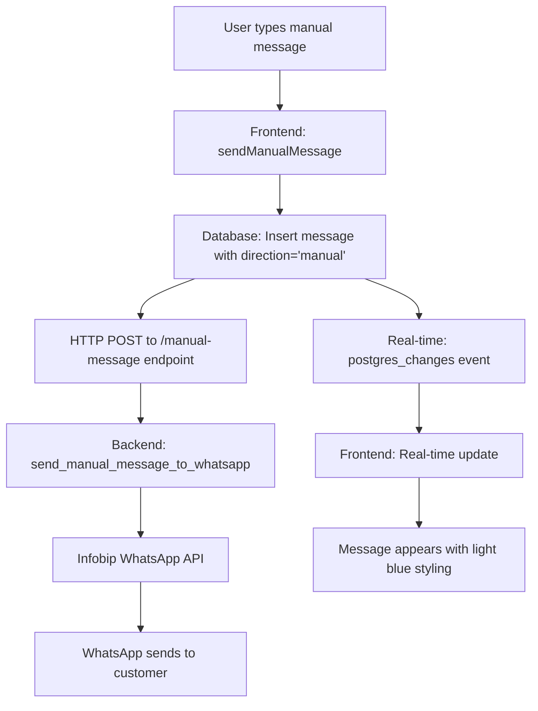
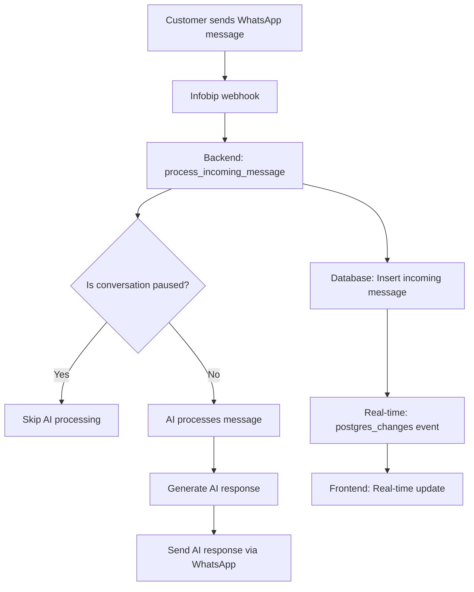
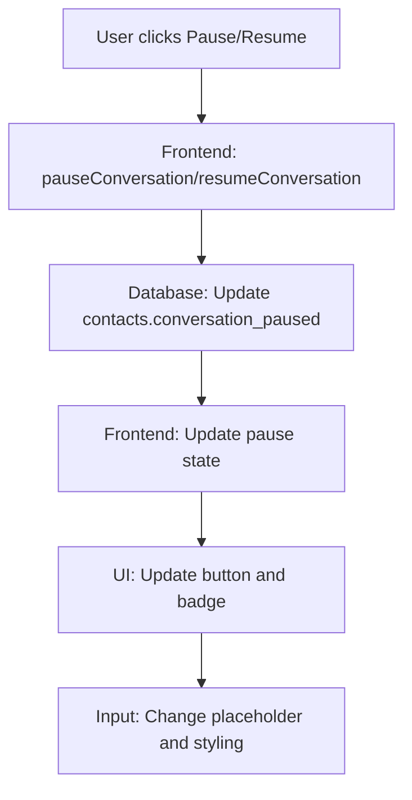

# Conversation Pause & Manual Messages Implementation Guide

## 📋 Overview

This document provides a comprehensive guide to the **Conversation Pause & Manual Messages** feature implemented in the SwiftReplies.ai system. This feature allows users to pause AI responses for specific contacts and send manual messages directly to customers via WhatsApp.

---

## 🎯 Feature Requirements

### Primary Goals
1. **Conversation Pause**: Allow users to pause AI responses for specific contacts
2. **Manual Messages**: Enable users to send manual messages when conversations are paused
3. **Visual Differentiation**: Display manual messages with distinct styling (light blue background)
4. **Real-time Updates**: All messages appear in real-time in the frontend
5. **WhatsApp Integration**: Manual messages are sent to customers via WhatsApp
6. **Pagination**: Efficient loading of conversation history

---

## 🗃️ Database Schema Changes

### 1. Contacts Table Enhancements

```sql
-- Add conversation pause fields to contacts table
ALTER TABLE contacts 
ADD COLUMN IF NOT EXISTS conversation_paused BOOLEAN DEFAULT false,
ADD COLUMN IF NOT EXISTS paused_at TIMESTAMP WITH TIME ZONE,
ADD COLUMN IF NOT EXISTS paused_by_user_id INTEGER;

-- Add foreign key constraint for user who paused the conversation
DO $$ 
BEGIN 
    IF NOT EXISTS (
        SELECT 1 FROM information_schema.table_constraints 
        WHERE constraint_name = 'fk_contacts_paused_by_user' 
        AND table_name = 'contacts'
    ) THEN 
        ALTER TABLE contacts 
        ADD CONSTRAINT fk_contacts_paused_by_user 
        FOREIGN KEY (paused_by_user_id) REFERENCES users(id); 
    END IF; 
END $$;

-- Add index for efficient pause status queries
CREATE INDEX IF NOT EXISTS idx_contacts_paused 
ON contacts(user_id, conversation_paused);
```

### 2. Messages Table Enhancements

```sql
-- Expand direction column to support 'manual' messages
ALTER TABLE messages ALTER COLUMN direction TYPE VARCHAR(20);

-- Remove old constraint and add new one
ALTER TABLE messages DROP CONSTRAINT IF EXISTS chk_message_direction;
ALTER TABLE messages DROP CONSTRAINT IF EXISTS messages_direction_check;
ALTER TABLE messages ADD CONSTRAINT chk_message_direction 
CHECK (direction IN ('incoming', 'outgoing', 'manual'));

-- Add user_sent field to identify manual messages
ALTER TABLE messages ADD COLUMN IF NOT EXISTS user_sent BOOLEAN DEFAULT false;
UPDATE messages SET user_sent = false WHERE user_sent IS NULL;
```

### 3. Real-time Functionality

```sql
-- Add messages table to Supabase real-time publication
ALTER PUBLICATION supabase_realtime ADD TABLE messages;

-- Ensure replica identity for real-time updates
ALTER TABLE messages REPLICA IDENTITY FULL;
```

---

## 🔧 Database Functions (RPC)

### 1. Paginated Message Retrieval

```sql
CREATE OR REPLACE FUNCTION get_messages_by_contact_id_paginated(
    target_contact_id INTEGER, 
    limit_param INTEGER, 
    offset_param INTEGER
)
RETURNS TABLE (
    id INTEGER,
    message_id VARCHAR(255),
    contact_id INTEGER,
    direction VARCHAR(20),
    message_type VARCHAR(50),
    content_text TEXT,
    content_url VARCHAR(2048),
    status VARCHAR(50),
    sent_at TIMESTAMP WITH TIME ZONE,
    metadata JSONB,
    created_at TIMESTAMP WITH TIME ZONE,
    chatbot_id INTEGER,
    ai_processed BOOLEAN,
    confidence_score NUMERIC,
    processing_duration INTEGER,
    error_details TEXT,
    user_sent BOOLEAN
) AS $$
BEGIN
    RETURN QUERY
    SELECT 
        m.id, m.message_id, m.contact_id, m.direction, m.message_type, 
        m.content_text, m.content_url, m.status, m.sent_at, m.metadata,
        m.created_at, m.chatbot_id, m.ai_processed, m.confidence_score, 
        m.processing_duration, m.error_details, m.user_sent
    FROM messages m
    WHERE m.contact_id = target_contact_id
    ORDER BY m.created_at DESC  -- Most recent first for pagination
    LIMIT limit_param
    OFFSET offset_param;
END;
$$ LANGUAGE plpgsql;
```

### 2. Updated Original Function

```sql
CREATE OR REPLACE FUNCTION get_messages_by_contact_id(
    target_contact_id INTEGER, 
    limit_param INTEGER
)
RETURNS TABLE (
    id INTEGER,
    message_id VARCHAR(255),
    contact_id INTEGER,
    direction VARCHAR(20),
    message_type VARCHAR(50),
    content_text TEXT,
    content_url VARCHAR(2048),
    status VARCHAR(50),
    sent_at TIMESTAMP WITH TIME ZONE,
    metadata JSONB,
    created_at TIMESTAMP WITH TIME ZONE,
    chatbot_id INTEGER,
    ai_processed BOOLEAN,
    confidence_score NUMERIC,
    processing_duration INTEGER,
    error_details TEXT,
    user_sent BOOLEAN
) AS $$
BEGIN
    RETURN QUERY
    SELECT 
        m.id, m.message_id, m.contact_id, m.direction, m.message_type, 
        m.content_text, m.content_url, m.status, m.sent_at, m.metadata,
        m.created_at, m.chatbot_id, m.ai_processed, m.confidence_score, 
        m.processing_duration, m.error_details, m.user_sent
    FROM messages m
    WHERE m.contact_id = target_contact_id
    ORDER BY m.created_at ASC
    LIMIT limit_param;
END;
$$ LANGUAGE plpgsql;
```

---

## 💻 Frontend Implementation

### 1. Updated Interfaces

**File**: `swiftreplies_frontend/lib/supabase/database.ts`

```typescript
export interface Contact {
  // ... existing fields
  conversation_paused?: boolean
  paused_at?: string
  paused_by_user_id?: number
}

export interface Message {
  // ... existing fields
  direction: 'incoming' | 'outgoing' | 'manual'
  user_sent?: boolean
}
```

### 2. Database Service Methods

**File**: `swiftreplies_frontend/lib/supabase/database.ts`

```typescript
// Pause conversation
async pauseConversation(contactId: number): Promise<boolean> {
  const dbUser = await this.getCurrentDatabaseUser()
  if (!dbUser) return false

  const { error } = await this.supabase
    .from('contacts')
    .update({
      conversation_paused: true,
      paused_at: new Date().toISOString(),
      paused_by_user_id: dbUser.id
    })
    .eq('id', contactId)
    .eq('user_id', dbUser.id)

  return !error
}

// Resume conversation
async resumeConversation(contactId: number): Promise<boolean> {
  const dbUser = await this.getCurrentDatabaseUser()
  if (!dbUser) return false

  const { error } = await this.supabase
    .from('contacts')
    .update({
      conversation_paused: false,
      paused_at: null,
      paused_by_user_id: null
    })
    .eq('id', contactId)
    .eq('user_id', dbUser.id)

  return !error
}

// Send manual message
async sendManualMessage(contactId: number, messageText: string): Promise<boolean> {
  const dbUser = await this.getCurrentDatabaseUser()
  if (!dbUser) return false

  // Insert message into database
  const { data, error } = await this.supabase
    .from('messages')
    .insert({
      contact_id: contactId,
      direction: 'manual',
      message_type: 'text',
      content_text: messageText,
      status: 'pending',
      sent_at: new Date().toISOString(),
      chatbot_id: dbUser.id,
      ai_processed: false,
      user_sent: true
    })
    .select('id')
    .single()

  if (error || !data) return false

  // Send HTTP webhook to WhatsApp fetcher
  try {
    const response = await fetch(`${WHATSAPP_FETCHER_URL}/manual-message`, {
      method: 'POST',
      headers: { 'Content-Type': 'application/json' },
      body: JSON.stringify({
        message_id: data.id,
        contact_id: contactId,
        content_text: messageText,
        user_id: dbUser.id
      })
    })
    return response.ok
  } catch (error) {
    console.error('Failed to trigger manual message webhook:', error)
    return false
  }
}

// Paginated message retrieval
async getMessagesForContact(contactId: number, limit: number = 50, offset: number = 0): Promise<Message[]> {
  const { data, error } = await this.supabase.rpc('get_messages_by_contact_id_paginated', {
    target_contact_id: contactId,
    limit_param: limit,
    offset_param: offset
  })

  if (error) {
    console.error('Error fetching messages:', error)
    return []
  }

  return data || []
}
```

### 3. Conversations Page Updates

**File**: `swiftreplies_frontend/components/pages/conversations-page.tsx`

#### Key Features Added:
- **Pause/Resume Button**: Dynamic button in chat header
- **Status Badge**: Shows "Paused" or "Active" status
- **Manual Message Input**: Different styling when paused
- **Message Styling**: Light blue background for manual messages
- **Pagination**: Load 20 messages initially, scroll to load more
- **Real-time Updates**: PostgreSQL changes subscription

#### State Management:
```typescript
const [pauseStates, setPauseStates] = useState<Record<number, boolean>>({})
const [sendingManualMessage, setSendingManualMessage] = useState(false)
const [loadingMoreMessages, setLoadingMoreMessages] = useState(false)
const [hasMoreMessages, setHasMoreMessages] = useState(true)
const MESSAGES_PER_PAGE = 20
```

#### Message Styling:
```typescript
const getMessageStyling = (message: Message) => {
  if (message.direction === 'manual') {
    return {
      containerClass: 'justify-end',
      bubbleClass: 'bg-sky-400 text-white',  // Light blue background
      textColor: 'text-sky-100',
      label: 'You sent manually'
    }
  }
  // ... other message types
}
```

#### Real-time Subscription:
```typescript
useEffect(() => {
  if (!selectedConversation) return

  const channel = supabase
    .channel(`messages-${selectedConversation.id}`)
    .on('postgres_changes', {
      event: 'INSERT',
      schema: 'public',
      table: 'messages',
      filter: `contact_id=eq.${selectedConversation.id}`
    }, handleNewMessage)
    .subscribe()

  return () => {
    supabase.removeChannel(channel)
  }
}, [selectedConversation, handleNewMessage])
```

---

## 🔧 Backend Implementation

### 1. Multi-tenant Database Updates

**File**: `whatsapp_folder/src/multi_tenant_database.py`

```python
async def is_conversation_paused(self, contact_id: int) -> bool:
    """Check if conversation is paused for a specific contact"""
    query = "SELECT conversation_paused FROM contacts WHERE id = %s"
    result = await self.fetch_one(query, (contact_id,))
    return result and result.get('conversation_paused', False)

async def update_message_status(self, message_id: int, status: str):
    """Update message status without updating non-existent updated_at column"""
    query = """
        UPDATE messages 
        SET status = %s 
        WHERE id = %s
    """
    await self.execute_query(query, (status, message_id))
```

### 2. WhatsApp Message Fetcher Updates

**File**: `whatsapp_folder/whatsapp_message_fetcher_multitenant.py`

#### CORS Configuration:
```python
from fastapi.middleware.cors import CORSMiddleware

app.add_middleware(
    CORSMiddleware,
    allow_origins=["*"],  # Configure appropriately for production
    allow_credentials=True,
    allow_methods=["*"],
    allow_headers=["*"],
)
```

#### Manual Message Endpoint:
```python
@app.post("/manual-message")
async def handle_manual_message(request: dict):
    """Handle manual message webhook from frontend"""
    try:
        message_id = request.get('message_id')
        contact_id = request.get('contact_id') 
        content_text = request.get('content_text')
        user_id = request.get('user_id')
        
        if not all([message_id, contact_id, content_text]):
            raise HTTPException(status_code=400, detail="Missing required fields")
        
        # Send message via WhatsApp
        success = await send_manual_message_to_whatsapp(
            message_id, contact_id, content_text, user_id
        )
        
        if success:
            return {"status": "success", "message": "Manual message sent"}
        else:
            return {"status": "error", "message": "Failed to send message"}
            
    except Exception as e:
        logger.error(f"Error handling manual message: {e}")
        raise HTTPException(status_code=500, detail=str(e))
```

#### Pause Check Integration:
```python
async def process_incoming_message(contact_phone: str, message_text: str, contact_id: int):
    """Process incoming messages with pause check"""
    # Check if conversation is paused
    is_paused = await db_manager.is_conversation_paused(contact_id)
    if is_paused:
        logger.info(f"Conversation paused for contact {contact_id}, skipping AI processing")
        return
    
    # Continue with normal AI processing...
```

---

## 🔄 Message Flow Architecture

### 1. Manual Message Flow



### 2. Incoming Message Flow



### 3. Pause/Resume Flow



---

## 🎨 UI/UX Features

### 1. Visual Elements

#### Chat Header:
- **Pause/Resume Button**: Toggles between "Pause" and "Resume" with appropriate icons
- **Status Badge**: 
  - 🟢 "Active" (green) when conversation is active
  - 🟠 "Paused" (orange) when conversation is paused

#### Message Bubbles:
- **Manual Messages**: Light blue background (`bg-sky-400`)
- **AI Responses**: Blue background (`bg-[#4A4AFF]`)
- **Incoming Messages**: Gray background

#### Message Input:
- **Active State**: Standard placeholder "Type a message..."
- **Paused State**: Orange border, "Send manual message to contact..." placeholder
- **Send Button**: Changes to sky blue when paused

### 2. Pagination System

#### Initial Load:
- Loads 20 most recent messages
- Auto-scrolls to bottom

#### Load More:
- "Load older messages" button at top of chat
- Intersection Observer for automatic loading when scrolling up
- Smooth loading states with spinner

---

## 🔒 Security & Performance

### 1. Security Measures

#### Database:
- Foreign key constraints on user relationships
- Check constraints on message directions
- User-specific queries with proper filtering

#### API:
- CORS configuration for cross-origin requests
- Input validation on all endpoints
- Error handling with appropriate HTTP status codes

### 2. Performance Optimizations

#### Database:
- Indexed pause status queries (`idx_contacts_paused`)
- Paginated message loading (20 messages per page)
- Efficient ordering by `created_at DESC`

#### Frontend:
- Real-time subscriptions only for active conversations
- Debounced scroll handlers
- Intersection Observer for efficient pagination

#### Backend:
- Async/await patterns for non-blocking operations
- Connection pooling for database operations
- Efficient message status updates

---

## 🧪 Testing & Debugging

### 1. Debug Features Implemented

#### Console Logging:
- Message loading: `🔍 LOADED X total messages`
- Message rendering: `🎨 RENDERING X messages`
- Real-time updates: `📩 Handling new message`

#### Database Verification:
- Direct SQL queries to verify message storage
- RPC function testing for pagination
- Real-time publication verification

### 2. Common Issues & Solutions

#### Issue: Messages disappearing on refresh
**Solution**: Updated `get_messages_by_contact_id` RPC function to include all columns

#### Issue: Manual messages not sending to WhatsApp
**Solution**: Implemented HTTP webhook system replacing unreliable NOTIFY/LISTEN

#### Issue: Real-time updates not working
**Solution**: Added `messages` table to `supabase_realtime` publication

#### Issue: CORS errors on manual message endpoint
**Solution**: Added `CORSMiddleware` to FastAPI application

---

## 📁 File Structure Summary

### Frontend Files Modified:
```
swiftreplies_frontend/
├── lib/supabase/database.ts          # Database service methods
└── components/pages/
    └── conversations-page.tsx        # Main conversation UI
```

### Backend Files Modified:
```
whatsapp_folder/
├── src/
│   ├── multi_tenant_database.py     # Database operations
│   └── multi_tenant_config.py       # Configuration
└── whatsapp_message_fetcher_multitenant.py  # Main application
```

### Documentation Created:
```
whatsapp_folder/
├── CONVERSATION_PAUSE_AND_MANUAL_MESSAGES_IMPLEMENTATION.md
└── MANUAL_MESSAGE_WEBHOOK_SETUP.md  # (Referenced in implementation)
```

---

## 🚀 Deployment Checklist

### Database Setup:
- [ ] Run all SQL schema updates
- [ ] Verify RPC functions created
- [ ] Check real-time publication includes `messages` table
- [ ] Test pagination function with sample data

### Frontend Deployment:
- [ ] Deploy updated React components
- [ ] Verify real-time subscriptions working
- [ ] Test pagination UI
- [ ] Confirm manual message styling

### Backend Deployment:
- [ ] Deploy updated Python application
- [ ] Verify CORS configuration
- [ ] Test manual message endpoint
- [ ] Monitor WhatsApp API integration

### Testing:
- [ ] End-to-end manual message flow
- [ ] Pause/resume functionality
- [ ] Real-time message updates
- [ ] Pagination performance
- [ ] WhatsApp delivery confirmation

---

## 📞 Support & Troubleshooting

### Common Commands:

#### Check message count:
```sql
SELECT direction, COUNT(*) FROM messages GROUP BY direction;
```

#### Verify pause status:
```sql
SELECT id, phone_number, conversation_paused, paused_at 
FROM contacts WHERE conversation_paused = true;
```

#### Test RPC function:
```sql
SELECT COUNT(*) FROM get_messages_by_contact_id_paginated(18, 20, 0);
```

### Log Monitoring:
- Frontend: Browser console for real-time updates
- Backend: Application logs for WhatsApp integration
- Database: Supabase logs for RPC function performance

---

## ✅ Summary

This implementation provides a complete **Conversation Pause & Manual Messages** system with:

- ✅ **Database schema** supporting pause states and manual messages
- ✅ **Real-time frontend** with pagination and visual differentiation  
- ✅ **Backend integration** with WhatsApp API via HTTP webhooks
- ✅ **Security measures** and performance optimizations
- ✅ **Comprehensive testing** and debugging capabilities

The system is production-ready and provides a seamless experience for users to pause AI conversations and send manual messages directly to customers via WhatsApp.